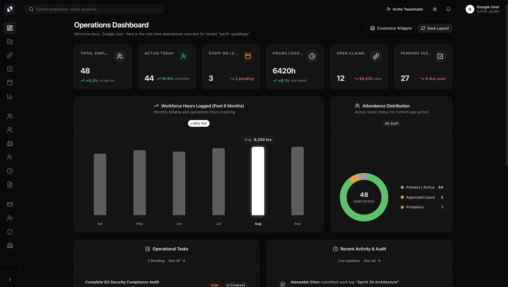
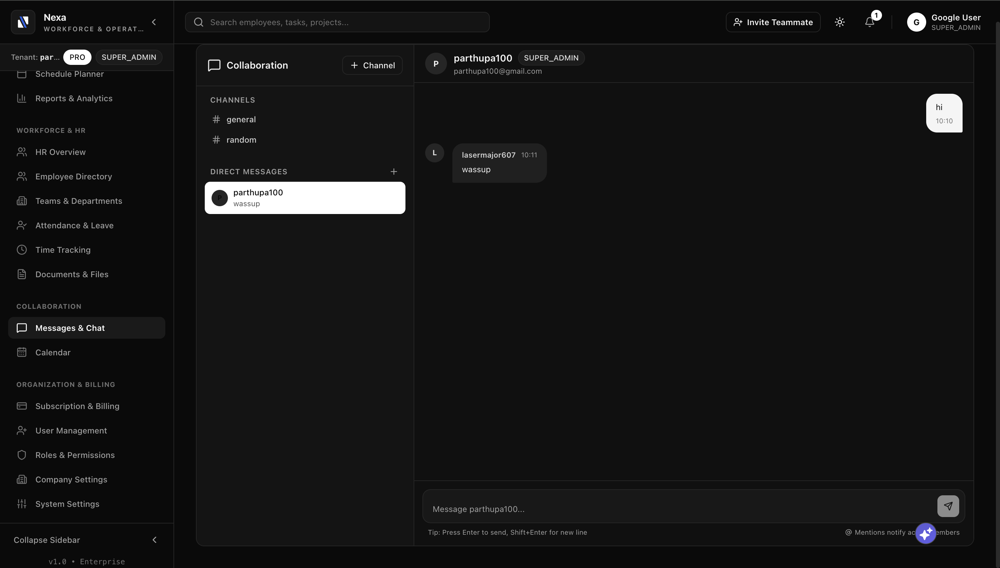
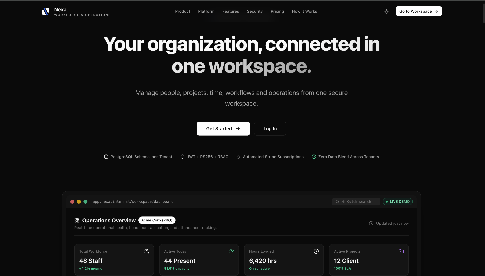
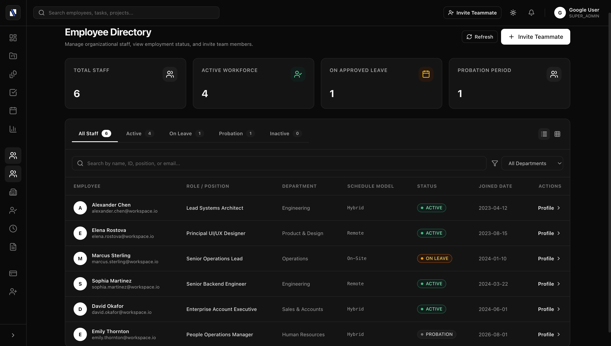
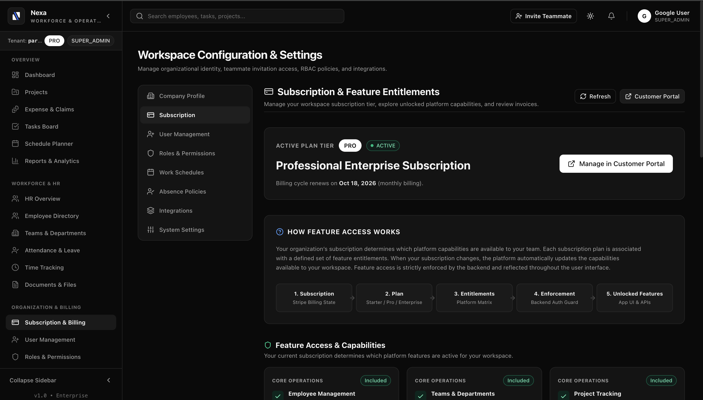
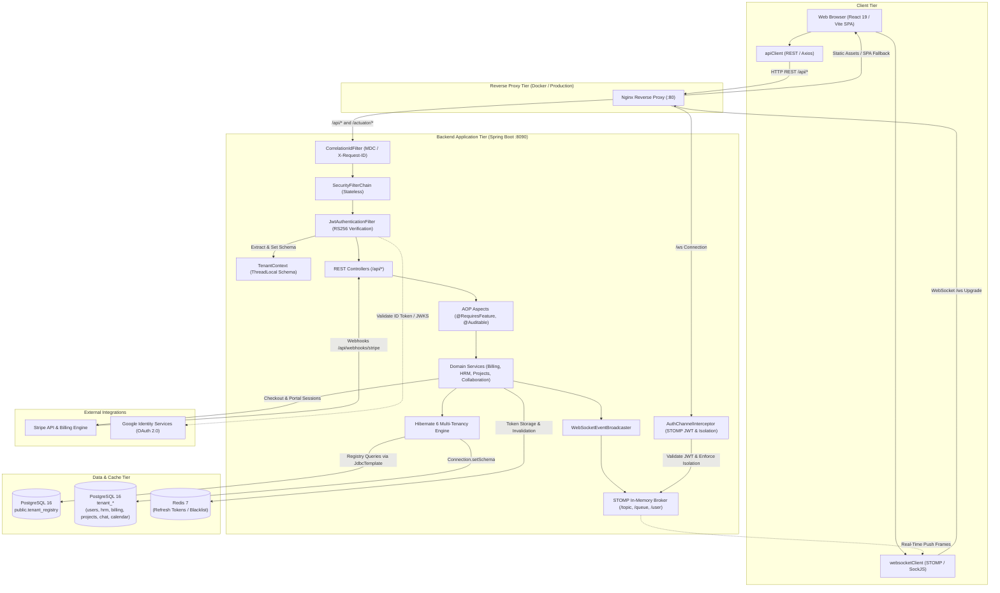
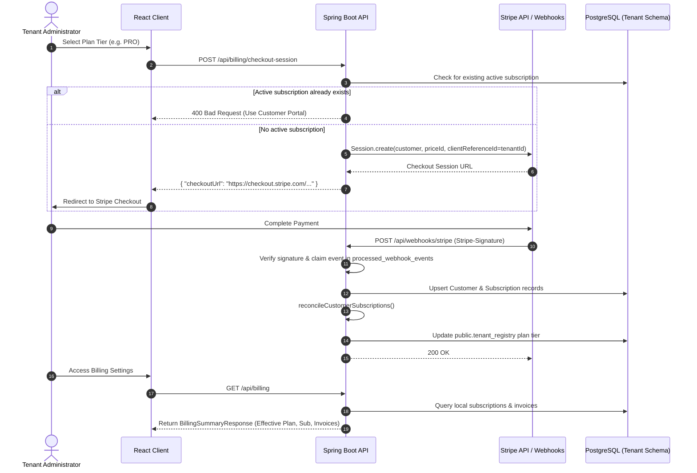

# Nexa — Workforce & Operations SaaS Platform

[](https://openjdk.org/)
[](https://spring.io/projects/spring-boot)
[](https://react.dev/)
[](https://www.typescriptlang.org/)
[](https://www.postgresql.org/)
[](https://redis.io/)
[](https://www.docker.com/)
[](https://stripe.com/)
[](https://opensource.org/licenses/MIT)

Nexa is an enterprise-grade, multi-tenant workforce and operations SaaS platform built with a schema-per-tenant architecture on PostgreSQL, Spring Boot, and React. Engineered for organizational agility and strict data governance, Nexa combines comprehensive workforce directory management, persistent project and task tracking, real-time team collaboration, an internal milestone calendar, role-based access control (RBAC), fine-grained feature entitlements, automated Stripe billing synchronization with deterministic subscription reconciliation, and asynchronous audit logging into a unified, secure platform.

---

## Table of Contents

- [Overview](#overview)
- [Screenshots](#screenshots)
- [Key Features](#key-features)
- [Architecture](#architecture)
- [Multi-Tenancy](#multi-tenancy)
- [Authentication & Authorization](#authentication--authorization)
- [Subscription & Billing](#subscription--billing)
- [Plans & Entitlements](#plans--entitlements)
- [Security](#security)
- [Observability](#observability)
- [Tech Stack](#tech-stack)
- [Project Structure](#project-structure)
- [API Overview](#api-overview)
- [Local Development](#local-development)
- [Environment Variables](#environment-variables)
- [Docker](#docker)
- [Database & Migrations](#database--migrations)
- [Testing](#testing)
- [Billing Testing / Stripe Development](#billing-testing--stripe-development)
- [Deployment](#deployment)
- [Production Considerations](#production-considerations)
- [Troubleshooting & Operational Runbook](#troubleshooting--operational-runbook)
- [Roadmap](#roadmap)
- [Contributing](#contributing)
- [License](#license)
- [Author / Project](#author--project)

---

## Overview

Modern organizations require segregated operational boundaries without sacrificing centralized management. Nexa solves this challenge by delivering:

- **Target Audience:** Mid-market to enterprise companies, departmental organizations, and software providers requiring strict multi-tenant data isolation.
- **Core Purpose:** Consolidate workforce personnel records, departmental hierarchies, project oversight, operational expenses/claims, and subscription lifecycle management into a cohesive, secure interface.
- **Multi-Tenant Architecture:** Employs a dedicated schema-per-tenant pattern on PostgreSQL. Each onboarded tenant receives an isolated relational schema, eliminating cross-tenant data leakage while maintaining a central `public` registry for tenant routing and billing state.
- **Operational Domains:**
  - **Workforce & HRM:** Centralized employee records, departmental tracking, work models (Remote, Hybrid, On-Site), and workforce statistics.
  - **Projects & Operations:** Persistent project lifecycles, interactive Kanban boards, task assignments, departmental budget utilization, and tiered reporting.
  - **Collaboration & Real-Time Workspace:** STOMP-over-WebSocket team channels, project-linked discussion feeds, 1-to-1 direct messaging, persistent in-app notifications, and an internal milestone calendar.
  - **Identity & Security:** Dual authentication (Local BCrypt + Google OIDC), RS256 asymmetric JWT issuance, Redis-backed single-use refresh token rotation, and non-bypassable Role-Based Access Control (RBAC).
  - **Self-Service Billing:** Server-side Stripe Checkout, Stripe Customer Portal integration, transactional webhook ingestion, and deterministic subscription reconciliation.

---

## Screenshots

Visual walkthrough of Nexa across its core operational interfaces:

| Module | Description | Preview |
|---|---|---|
| **[Workspace Dashboard](#workspace-dashboard)** | Operational metrics, attendance rates, headcount, and recent audit activity | [Jump to preview ↓](#workspace-dashboard) |
| **[Collaboration & Team Chat](#collaboration--team-chat)** | Real-time workspace channels, project-linked chats, 1-to-1 DMs, and @mentions | [Jump to preview ↓](#collaboration--team-chat) |
| **[Public SaaS Landing Page](#public-saas-landing-page)** | Public overview, value proposition, and self-service tier selection | [Jump to preview ↓](#public-saas-landing-page) |
| **[HRM & Employee Directory](#hrm--employee-directory)** | Comprehensive personnel records, departmental filters, and status badges | [Jump to preview ↓](#hrm--employee-directory) |
| **[Subscription & Billing Management](#subscription--billing-management)** | Stripe-backed tier subscriptions, portal redirects, and invoice history | [Jump to preview ↓](#subscription--billing-management) |

---

### Workspace Dashboard
Executive operational dashboard tracking active headcount, attendance percentages, billable hours, department breakdown, and recent audit events.



---

### Collaboration & Team Chat
Real-time team communication featuring workspace channels, project-linked channels, private 1-to-1 direct messaging, unread counts, and rich @mentions.



---

### Public SaaS Landing Page
Public-facing SaaS marketing and onboarding page highlighting core features, tenant security model, and self-service subscription tiers (Starter, Professional, Enterprise).



---

### HRM & Employee Directory
Centralized workforce directory featuring real-time department filtering, employee lifecycle status badges, manager reporting structures, and work model tracking (Remote, Hybrid, On-Site).



---

### Subscription & Billing Management
Self-service billing dashboard with active plan entitlements, Stripe Checkout upgrade flows, Stripe Customer Portal management, and synchronized invoice histories.



---

## Key Features

### Workforce Management & HRM
- **Employee Directory:** Complete lifecycle employee management including position, department assignment, manager reporting lines, hire dates, contact info, and work model classification (Remote, Hybrid, On-Site).
- **Department Administration:** Department creation, lead assignment, team budget utilization tracking, and headcount distribution.
- **Operational Metrics:** Real-time calculation of active headcount, department distribution, average attendance rates, and billable hour metrics.
- **Workforce Operations UI:** Frontend interfaces for attendance and leave tracking, work schedules, time tracking, and organizational document management.

### Projects, Tasks & Operations
- **Persistent Project Lifecycles:** PostgreSQL-persisted project records supporting status management (`PLANNING`, `ACTIVE`, `ON_HOLD`, `COMPLETED`, `CANCELLED`), priority levels, budgets, target dates, and ownership.
- **Enterprise Task Tracking & Kanban:** Interactive Kanban boards with column drag-and-drop transitions (`TODO`, `IN_PROGRESS`, `REVIEW`, `DONE`), priority badges (`LOW`, `MEDIUM`, `HIGH`, `URGENT`), due-date alerts, overdue filters, and assignee management.
- **Project Members & Collaboration Context:** Project membership bindings (`MANAGER`, `CONTRIBUTOR`, `VIEWER`) integrated with real-time project discussion channels.
- **Tiered Reporting Engine:** Method-level feature gated reports providing basic summaries, advanced cost and utilization metrics, analytics run rates, and custom escalation matrices.
- **Expense & Claims Management:** Expense claim logging, approval statuses, and cost categorization.

### Collaboration & Real-Time Workspace
- **Workspace Channels:** Public and team channels (e.g. `#general`, `#random`) with role-based management, message persistence, and paginated history.
- **Project-Linked Channels:** Automatic derivation of project-specific channels (`#proj-<slug>`) synchronized with persistent project records, enabling focused cross-functional discussions.
- **1-to-1 Direct Messaging:** Private bilateral chat between workspace colleagues featuring persistent threads and unread message indicators.
- **Real-Time STOMP Delivery:** WebSocket communication over `/ws` using Spring's simple message broker, delivering sub-second updates for new messages, typing cues, and unread alerts.
- **Rich Mentions & Notifications:** In-message `@mention` parsing that resolves against workspace users and automatically generates persistent, real-time in-app notifications.
- **In-App Notification Center:** Header notification bell with real-time push alerts, unread count badges, notification detail modals, and mark-as-read/mark-all-read capabilities. Triggered by task assignments, task completions, project membership additions, DMs, and @mentions.
- **Project Detail Chat Tab:** Embedded 6th tab on the Project Detail view (`Overview`, `Tasks`, `Kanban`, `Members`, `Activity`, and `Chat`) connecting discussions directly to project context.
- **Internal Workspace Calendar:** Fully self-contained organizational calendar supporting month grid and agenda views, custom event creation with multi-attendee tracking, date-range filtering, and automatic milestone projection for project deadlines and task due dates.
- **Schema-Per-Tenant Data Isolation:** Complete database-level segregation ensures all chat channels, messages, direct conversations, notifications, and calendar events reside exclusively within tenant-specific schemas.

> [!NOTE]
> **Scope & Architectural Boundaries:** Nexa Collaboration v1 is designed strictly as an **internal workforce communication and coordination layer** scoped to the authenticated tenant workspace. It does not integrate external collaboration suites (e.g., Slack, Microsoft Teams), third-party calendars (e.g., Google Calendar, Outlook 365), voice/video telephony, screen sharing, or AI scheduling.

### Identity & Security Controls
- **Dual Authentication Modes:** Native email/password authentication using BCrypt password hashing alongside verified Google Identity Services (GIS) OIDC integration.
- **Asymmetric JWTs (RS256):** Access tokens cryptographically signed using RSA-2048 private keys and verified via Nimbus JWT decoders.
- **Refresh Token Rotation:** Ephemeral single-use refresh tokens stored with TTL in Redis. Reusing or renewing a refresh token revokes the previous token JTI, defending against replay attacks.
- **Hierarchical RBAC:** Explicit role hierarchy (`SUPER_ADMIN > ADMIN > MANAGER > USER`) enforced through Spring Security expression handlers and `@PreAuthorize`.
- **Privilege Escalation Defense:** Programmatic validation prevents `ADMIN` accounts from creating or inviting `SUPER_ADMIN` accounts.
- **Auditing & Traceability:** Declarative `@Auditable` AOP aspect that records actor ID, role, action, outcome, and failure reason in tenant-scoped audit tables.

### Subscription & Billing Engine
- **Stripe Checkout Sessions:** Server-initiated session generation mapped to tenant subscription tiers with automatic customer binding.
- **Stripe Customer Portal:** Direct self-service portal URL provisioning allowing administrators to manage credit cards, view invoices, upgrade, or cancel plans.
- **Transactional Webhook Processing:** Signature-verified endpoint handling Stripe events with atomic deduplication via `processed_webhook_events`.
- **Deterministic Current Subscription Resolution:** Multi-subscription evaluation that preserves invoice history while cleanly selecting the active governing entitlement.
- **Entitlement Matrix:** Spring AOP `@RequiresFeature` annotations that enforce runtime authorization boundaries on backend API routes based on the tenant's reconciled plan tier.

### Platform Engineering
- **Schema-Per-Tenant Multi-Tenancy:** Custom Hibernate SPI implementations (`MultiTenantConnectionProvider` and `CurrentTenantIdentifierResolver`) that dynamically route queries to the correct tenant schema.
- **Distributed Caching & Invalidation:** Redis 7 infrastructure managing revoked refresh tokens and short-lived session state.
- **Request Correlation:** Global `CorrelationIdFilter` ensuring every HTTP request propagates an `X-Request-ID` header and MDC logging context.
- **Automated Database Lifecycle:** Dual-mode Flyway engine handling public registry migrations on boot and schema-level tenant migrations on registration.

---

## Architecture

Nexa follows a decoupled architecture separating a stateless Spring Boot REST API and real-time STOMP message broker backend from an optimized React Single Page Application (SPA).



### Architectural Separation & Request Lifecycle

1. **Client Tier:** React 19 SPA built with TypeScript, Vite, and Tailwind CSS. Centralizes API communication through a typed `apiClient` supporting automatic JWT attachment, interceptor queues, and transparent token refreshing, alongside a managed `websocketClient` for persistent STOMP messaging over SockJS.
2. **Reverse Proxy:** In containerized deployments, Nginx terminates HTTP on port `80`, serves static production assets with gzip compression, handles client-side routing fallbacks via `try_files`, and reverse-proxies `/api/`, `/actuator/`, and `/ws` WebSocket upgrade requests to the Spring Boot application.
3. **Security Pipeline:**
   - `CorrelationIdFilter` captures incoming `X-Request-ID` or generates a UUID, binds it to SLF4J MDC, and appends it to response headers.
   - `JwtAuthenticationFilter` intercepts the Bearer token, validates signatures using the RS256 public key, verifies tenant validity against `public.tenant_registry`, and loads authorities into Spring Security's `SecurityContextHolder`.
   - The verified `schema_name` is bound to `TenantContext` (`ThreadLocal`).
4. **Data Routing:** Hibernate queries intercept the `TenantContext` through `TenantIdentifierResolver`. The `TenantConnectionProvider` acquires a pooled connection from HikariCP and executes `Connection.setSchema(tenantIdentifier)` before query execution, resetting back to `public` upon connection release.
5. **Thread Safety:** Every filter and controller invoking `TenantContext.setTenant(...)` guarantees execution of `TenantContext.clear()` inside a `finally` block to prevent schema leaks across HikariCP worker threads.
6. **Dual-Protocol Communication Pattern:**
   - **REST Engine (`/api/*`):** Serves as the authoritative backbone for transactional state mutations, paginated historical retrieval (channel logs, direct messages, user notifications), date-window queries, and administrative CRUD operations.
   - **WebSocket / STOMP Engine (`/ws`):** Provides sub-second reactive push delivery for new channel messages, 1-to-1 direct messages, user notification counters, and organizational calendar updates.
7. **WebSocket Security & Subscription Lifecycle:**
   - Connections to `/ws` authenticate during the STOMP `CONNECT` frame via `Authorization: Bearer <token>`.
   - `AuthChannelInterceptor` verifies token signatures, validates that the tenant is active in `public.tenant_registry`, checks that the user account is enabled, establishes the Spring Security principal, and binds `tenant_id`, `tenant_schema`, and `user_id` to STOMP session attributes.
   - When subscribing to destinations (`SUBSCRIBE`), `AuthChannelInterceptor` enforces tenant boundaries: attempts to subscribe to foreign tenant topics (`/topic/tenant/{targetTenantId}/**`) are rejected with `SecurityException`, while direct message subscriptions (`/topic/tenant/{tenantId}/dm/{conversationId}`) verify bilateral user membership within the tenant's database schema.

---

## Multi-Tenancy

Nexa implements a strict **Schema-Per-Tenant** multi-tenancy model on PostgreSQL.

```
                    ┌───────────────────────────────┐
                    │     PostgreSQL Database       │
                    └───────────────┬───────────────┘
                                    │
            ┌───────────────────────┴───────────────────────┐
            ▼                                               ▼
┌───────────────────────────────┐               ┌───────────────────────────────┐
│        public Schema          │               │      tenant_<id> Schemas      │
├───────────────────────────────┤               ├───────────────────────────────┤
│ • tenant_registry             │               │ • users                       │
│   - tenant_id (slug)          │               │ • audit_logs                  │
│   - schema_name (tenant_*)    │               │ • customers                   │
│   - status (ACTIVE)           │               │ • subscriptions               │
│   - plan (FREE, PRO, ...)     │               │ • invoices                    │
│   - stripe_customer_id        │               │ • processed_webhook_events    │
│                               │               │ • departments                 │
│                               │               │ • employees                   │
│                               │               │ • projects                    │
│                               │               │ • project_members             │
│                               │               │ • tasks                       │
│                               │               │ • chat_channels               │
│                               │               │ • chat_messages               │
│                               │               │ • direct_conversations        │
│                               │               │ • direct_messages             │
│                               │               │ • notifications               │
│                               │               │ • calendar_events             │
│                               │               │ • calendar_event_attendees    │
└───────────────────────────────┘               └───────────────────────────────┘
```

### 1. Public Tenant Registry
The `public.tenant_registry` table acts as the global catalog for tenant resolution. Managed directly via Spring's `JdbcTemplate` to bypass tenant-scoped JPA routing, it tracks:
- `tenant_id`: URL-safe unique identifier (e.g. `acme-corp`).
- `schema_name`: Corresponding PostgreSQL schema (e.g. `tenant_acme_corp`).
- `status`: Tenant operational state (`ACTIVE`).
- `plan`: Reconciled subscription plan tier (`FREE`, `STARTER`, `PRO`, `ENTERPRISE`).
- `stripe_customer_id`: Mapped Stripe Customer ID.

### 2. Tenant Resolution & Lifecycle
- **Tenant Provisioning:** When a tenant signs up (`POST /api/auth/signup`), `TenantOnboardingService` validates the tenant slug against `^[a-z][a-z0-9_-]{0,49}$`, derives the schema name (`tenant_` + sanitized slug), executes schema-level Flyway migrations from `classpath:db/migration/tenant`, and registers the tenant in `public.tenant_registry`.
- **Automatic Schema Migration:** During backend startup, `TenantProvisioningService` listens for `ApplicationReadyEvent`, queries `public.tenant_registry` for all active schema names, and runs pending Flyway migrations against every tenant schema.
- **Isolation Guarantees:** Cross-tenant access is prevented at the database driver level via PostgreSQL `setSchema`. The application rejects user-controlled tenant parameters in business queries; all tenant resolution is derived exclusively from validated JWT claims across both HTTP REST requests and WebSocket STOMP subscription frames.

---

## Authentication & Authorization

### Authentication Mechanisms

Nexa supports two mutually compatible authentication paths:

1. **Local Email/Password:** Credentials validated against BCrypt password hashes stored in `users.password_hash`.
2. **Google Identity Services (GIS) OIDC:** Frontends submit Google ID tokens (`idToken`) to `POST /api/auth/google`. The backend validates token signatures and claims against Google's public JWKS endpoint (`https://www.googleapis.com/oauth2/v3/certs`), ensures `email_verified == true`, confirms audience matches `app.google.client-id`, and links the user's `google_subject`.
3. **Invitation Acceptance:** Invitations sent via `POST /api/users` generate a cryptographically random UUID token valid for 7 days. Users complete registration via `POST /api/auth/accept-invite`, setting their password and transitioning from `INVITED` to `ACTIVE`.

### Asymmetric JWT & Token Rotation

Tokens are issued via Nimbus JOSE using an RSA-2048 keypair (`jwt-private.pem` and `jwt-public.pem`):

| Token Type | Lifespan | Signature | Storage / State |
|---|---|---|---|
| **Access Token** | 15 minutes | RS256 | Stateless client memory / Bearer header; claims include `sub`, `tenant_id`, `role`. |
| **Refresh Token** | 7 days | RS256 | Single-use JTI tracked in Redis (`refresh:<jti>`). Claim includes `type: refresh`. |

**Rotation Flow:** When `/api/auth/refresh` receives a refresh token, it validates the RS256 signature, asserts `type == refresh`, checks Redis for existence of `refresh:<jti>`, immediately deletes the key in Redis (revocation), and issues a completely new access/refresh token pair. Replaying an old refresh token results in an immediate `401 Unauthorized`.

### Role-Based Access Control (RBAC)

Nexa configures a strict, single-directional role hierarchy:

```
SUPER_ADMIN
    ↓ (implies)
  ADMIN
    ↓ (implies)
 MANAGER
    ↓ (implies)
  USER
```

#### Role Permissions Matrix

| Capability | SUPER_ADMIN | ADMIN | MANAGER | USER |
|---|:---:|:---:|:---:|:---:|
| System Settings (`/app/settings/system`) | Yes | No | No | No |
| Invite `SUPER_ADMIN` Users | Yes | No | No | No |
| Invite `ADMIN`, `MANAGER`, `USER` | Yes | Yes | No | No |
| Manage Billing & Stripe Portal | Yes | Yes | No | No |
| Create / Update / Delete Employees | Yes | Yes | No | No |
| Manage Departments | Yes | Yes | No | No |
| Export Advanced Reports | Yes | Yes | No | No |
| View HRM Directory & Stats | Yes | Yes | Yes | No |
| View Assigned Tasks / Dashboard | Yes | Yes | Yes | Yes |
| Record Time Tracking & Attendance | Yes | Yes | Yes | Yes |

#### Privilege Escalation Prevention
In `UserController.java`, invitations sent to `POST /api/users` enforce business-level authorization checks:
```
if (request.role() == Role.SUPER_ADMIN && !isSuperAdmin()) {
    throw new ResponseStatusException(HttpStatus.FORBIDDEN, "Only SUPER_ADMIN can invite SUPER_ADMIN users");
}
```
An `ADMIN` cannot invite a `SUPER_ADMIN`, preventing vertical privilege escalation while preserving the Spring Security role hierarchy.

---

## Subscription & Billing

Nexa provides a Stripe-backed billing engine designed around a resilient reconciliation model.



### Core Concept: Effective Subscription Resolution

> **Architectural Invariant:** Stripe customer history may contain multiple subscription records (due to upgrades, plan transitions, test checkouts, or cancellation cycles). Nexa preserves full subscription and invoice history while deterministically selecting **one effective subscription** to govern the tenant's operational entitlements.

#### Subscription Statuses & Entitlement Mapping

| Status | Entitled? | Business Semantics |
|---|:---:|---|
| `ACTIVE` | Yes | Paid subscription in good standing. Grants paid plan tier features (`PRO`, `ENTERPRISE`). |
| `TRIALING` | Yes | Active trial period. Grants paid plan tier features. |
| `PAST_DUE` | Yes | Invoice payment failed; Stripe is retrying (dunning period). Entitlements remain active. |
| `PAUSED` | No | Subscription paused. Paid features revoked; falls back to `FREE` / `STARTER`. |
| `UNPAID` | No | Payment retries exhausted. Effective plan resolves to `FREE`. |
| `INCOMPLETE` | No | Initial payment incomplete (pending 3DS). Does not grant paid features. |
| `INCOMPLETE_EXPIRED`| No | Timed out checkout session. Terminal state. |
| `CANCELED` | No | Subscription terminated. Effective plan resolves to `FREE`. |

#### Cancellation at Period End vs Immediate Cancellation
When a subscription is set to cancel at the end of the billing period:
- `cancel_at_period_end = true`, but `status` remains `ACTIVE`.
- The subscription remains **entitled** through `current_period_end`.
- The billing UI displays `(Set to cancel at end of period)`.
- The subscription transitions to `status = CANCELED` only when Stripe sends `customer.subscription.deleted`.

#### Deterministic Selection Algorithm
When evaluating candidate subscriptions for a tenant customer:
1. **Entitlement Priority:** Entitled subscriptions (`ACTIVE`, `TRIALING`, `PAST_DUE`) always take precedence over non-entitled subscriptions (`CANCELED`, `UNPAID`, etc.).
2. **Recency Comparator:** Between candidate subscriptions in the same entitlement category, `BillingService.compareRecency()` selects the newest by evaluating:
   - `current_period_start` (Descending, nulls last)
   - `created_at` (Descending, nulls last)
   - `updated_at` (Descending, nulls last)
   - `id` (Descending primary key tie-breaker)
3. **Out-of-Order Webhook Protection:** Plan updates synchronize from the globally reconciled current subscription rather than whichever webhook arrived last, preventing stale webhooks from downgrading an active tier.
4. **Duplicate Checkout Prevention:** `POST /api/billing/checkout-session` rejects requests if an active subscription already exists (`400 Bad Request`), directing administrators to the Customer Portal (`POST /api/billing/portal-session`).

---

## Plans & Entitlements

### Plan Matrix

| Plan Tier | Price | Employee Limit | Included Features |
|---|---|---|---|
| **Starter / Free** | $0 / mo | Up to 10 | `EMPLOYEE_MANAGEMENT`, `TEAM_MANAGEMENT`, `PROJECT_MANAGEMENT`, `TASK_MANAGEMENT`, `TEAM_CHAT`, `NOTIFICATIONS`, `CALENDAR`, `CLAIMS`, `TIME_TRACKING`, `ATTENDANCE`, `LEAVE_MANAGEMENT`, `WORK_SCHEDULES`, `DOCUMENTS`, `BASIC_REPORTS` |
| **Professional (Pro)** | $49 / mo | Up to 100 | All Starter features plus: `ADVANCED_REPORTS`, `ADVANCED_ANALYTICS`, `ADVANCED_HRM`, Self-Service Portal, Automated Invoicing |
| **Enterprise Suite** | $199 / mo | Unlimited | All Pro features plus: `CUSTOM_WORKFLOWS`, `ADVANCED_INTEGRATIONS`, Custom Schedule Models, Dedicated Support |

### Backend Entitlement Enforcement

Feature entitlements are enforced on the backend via Spring AOP:
- `@RequiresFeature(Feature.<NAME>)`: Placed on controller methods or classes.
- `FeatureEntitlementAspect`: Intercepts method execution, queries `FeatureEntitlementService.hasFeature()`, and aborts unauthorized requests with `403 FORBIDDEN` if the tenant's effective plan does not include the feature.
- Frontend visibility controls are supplemented by this non-bypassable backend enforcement layer.

---

## Security

- **Cryptographic JWT Validation:** Access tokens signed via RSA-2048 private key and validated with RS256 public key.
- **Refresh Token Revocation in Redis:** Refresh tokens are single-use; rotation revokes the JTI immediately upon use.
- **Tenant Isolation:** Complete logical and physical database segregation via PostgreSQL schema-per-tenant. Dynamic schema selection driven exclusively by verified JWT claims.
- **WebSocket & Real-Time STOMP Security:**
  - Authenticated STOMP handshake over `/ws` requiring an RS256 Bearer JWT in the `CONNECT` frame's native headers.
  - Principal identity, user ID, role, and tenant context derived exclusively from cryptographically verified token claims; clients cannot forge or override tenant context.
  - Strict topic subscription authorization: `/topic/tenant/{tenantId}/**` destinations enforce matching tenant identity. Subscriptions targeting foreign tenant topics are intercepted and rejected with `SecurityException`.
  - Bilateral DM conversation authorization: Subscribing to `/topic/tenant/{tenantId}/dm/{conversationId}` verifies within the tenant schema that the authenticated user is an active participant in the conversation.
  - User-isolated notification destinations: Subscriptions to `/topic/tenant/{tenantId}/users/{userId}/notifications` verify that `userId` matches the authenticated subject.
  - Active user status check: Disabled or suspended user accounts are immediately rejected during STOMP frame interception.
- **Stripe Webhook Verification:** Cryptographic HMAC signature validation on all incoming webhooks using `STRIPE_WEBHOOK_SECRET`.
- **Webhook Idempotency:** Webhook event IDs are atomically claimed in `processed_webhook_events` before execution, defending against replay and duplicate delivery.
- **Audit Trail Logging:** Asynchronous AOP auditing via `@Auditable` logs all critical mutations with actor ID, role, outcome, and timestamp to tenant-local `audit_logs` tables.
- **Password Security:** Passwords hashed with BCrypt using secure salts.
- **CORS Protection:** Configurable origin matching via `app.cors.allowed-origins` supporting strict production domains while enabling localhost matching in development.
- **SQL Injection Prevention:** Spring Data JPA parameterized queries and parameterized `JdbcTemplate` calls; strict regex validation on tenant IDs and schema names.
- **Secret Management:** Private keys and external credentials injected exclusively through environment variables. Zero credentials committed to version control.

---

## Observability

Nexa integrates Spring Boot Actuator for runtime metrics and health probes:

- **Health Endpoint:** `GET /actuator/health` (Exposes overall service health).
- **Liveness Probe:** `GET /actuator/health/liveness` (Verifies process vitality for container orchestrators).
- **Readiness Probe:** `GET /actuator/health/readiness` (Verifies database and Redis connectivity before accepting ingress traffic).
- **Metrics Endpoint:** `GET /actuator/metrics` (Exposes JVM, thread pool, and HikariCP connection pool metrics).
- **Application Info:** `GET /actuator/info` (Build and metadata details).
- **Correlation & Request Tracing:** `CorrelationIdFilter` assigns or propagates an `X-Request-ID` across every HTTP request and logs it to SLF4J MDC (`requestId`).
- **Standardized Error Responses:** Handled by `GlobalExceptionHandler`, returning uniform JSON error bodies with HTTP status, error category, message, path, and validation field details.

---

## Tech Stack

| Layer | Technology | Version / Spec |
|---|---|---|
| **Backend Framework** | Spring Boot | 4.1.1 |
| **Backend Language** | Java (OpenJDK / Temurin) | 25 |
| **Real-Time Messaging** | Spring WebSocket / STOMP Broker | In-Memory Simple Broker |
| **Frontend Framework** | React | 19.2.8 |
| **Frontend Language** | TypeScript | ~6.0.2 |
| **WebSocket Client** | @stomp/stompjs & sockjs-client | 7.x / 1.6.x |
| **Build Tool (Frontend)** | Vite | 8.2.2 |
| **Styling** | Tailwind CSS | 4.3.3 |
| **Icons & UI** | Lucide React | 1.47.0 |
| **Client Routing** | React Router | 7.18.4 |
| **Primary Database** | PostgreSQL | 16 |
| **Connection Pooling** | HikariCP | 6.x |
| **Database Migrations** | Flyway (PostgreSQL engine) | 11.x |
| **Caching & Tokens** | Redis | 7 |
| **Security & JWT** | Spring Security / Nimbus JOSE | OAuth2 Resource Server (RS256) |
| **Payment Gateway** | Stripe Java SDK | 33.4.0 |
| **API Documentation** | Springdoc OpenAPI / Swagger UI | 3.1.0 |
| **Testing Framework** | JUnit 5 / Testcontainers | PostgreSQL Testcontainers |
| **Containerization** | Docker & Docker Compose | Multi-stage Dockerfiles |
| **Production Web Server** | Nginx | Alpine (Reverse proxy & SPA) |

---

## Project Structure

```
saas-platform/
├── .env.example                     # Environment configuration template
├── docker-compose.yml               # Local infrastructure (Postgres, Redis, Backend, Frontend)
├── README.md                        # Project documentation
│
├── backend/                         # Spring Boot 4.1 / Java 25 Application
│   ├── Dockerfile                   # Multi-stage Eclipse Temurin 25 container build
│   ├── pom.xml                      # Maven dependencies & build configuration
│   ├── src/
│   │   ├── main/
│   │   │   ├── java/com/yourco/saas/
│   │   │   │   ├── BackendApplication.java
│   │   │   │   ├── PingController.java
│   │   │   │   ├── auth/            # Authentication, JWT, Google OIDC, Refresh rotation
│   │   │   │   ├── billing/         # Stripe checkout, portal, webhook, entitlements, AOP
│   │   │   │   ├── collaboration/   # Chat channels, DMs, notifications, calendar, WebSocket broker
│   │   │   │   ├── common/          # Audit logging, email/storage abstractions, exception handling
│   │   │   │   ├── config/          # SecurityConfig, OpenAPI, CORS, CorrelationIdFilter
│   │   │   │   ├── domain/          # Entities & repos (User, Customer, Projects, Tasks, Collaboration)
│   │   │   │   ├── hrm/             # HRM service, controller, DTOs
│   │   │   │   ├── projects/        # Persistent Projects, Tasks, Kanban, Project Members
│   │   │   │   ├── rbac/            # RBAC verification debug endpoints
│   │   │   │   ├── reports/         # Tiered reporting endpoints with @RequiresFeature
│   │   │   │   ├── tenant/          # Schema-per-tenant resolvers, connection provider, provisioning
│   │   │   │   └── users/           # User listing, invitation service, privilege checks
│   │   │   └── resources/
│   │   │       ├── application.yaml # Application properties & Hikari pool configuration
│   │   │       ├── certs/           # RSA keypair for RS256 JWT signing
│   │   │       └── db/migration/
│   │   │           ├── global/      # Public schema Flyway migrations (tenant_registry)
│   │   │           └── tenant/      # Tenant schema migrations (users, billing, hrm, projects, chat)
│   │   └── test/                    # Integration & unit test suites (163 test methods)
│
└── frontend/                        # React 19 / TypeScript / Vite 8 Application
    ├── Dockerfile                   # Multi-stage Node 22 build with Nginx Alpine runtime
    ├── nginx.conf                   # Nginx reverse proxy configuration (/api/, /actuator/, /ws, SPA)
    ├── package.json                 # Frontend dependencies & npm scripts
    ├── vite.config.ts               # Vite configuration with Tailwind CSS plugin
    └── src/
        ├── api/                     # Typed API clients (auth, billing, hrm, projects, chat, calendar)
        ├── collaboration/           # WebSocket STOMP client over SockJS (websocketClient.ts)
        ├── components/
        │   ├── common/              # Buttons, Badges, Modals, Cards, NexaLogo
        │   ├── landing/             # Public landing page sections
        │   └── layout/              # AppShell, Sidebar, TopHeader, NotificationDropdown
        ├── context/                 # AuthContext, EntitlementsContext, NotificationContext, ThemeContext
        ├── pages/
        │   ├── auth/                # Login, Signup, AcceptInvite
        │   ├── billing/             # Billing management, Stripe Success/Cancel redirects
        │   ├── calendar/            # Workspace calendar with project/task milestone projections
        │   ├── chat/                # Workspace channels and 1-to-1 direct messaging
        │   ├── dashboard/           # Main workspace dashboard
        │   ├── hrm/                 # Employee directory, profiles, teams, attendance, tracking
        │   ├── operations/          # Claims, Schedules
        │   ├── projects/            # Project list, detail view, members, and embedded Chat tab
        │   ├── reports/             # Tiered reports & export controls
        │   ├── settings/            # Company, Users, Roles, Integrations, System settings
        │   └── tasks/               # Enterprise task management & Kanban board
        └── routes/                  # React Router configuration & ProtectedRoute guards
```

---

## API Overview

### Authentication (`/api/auth`)

| Method | Path | Access | Description |
|---|---|---|---|
| `POST` | `/api/auth/signup` | Public | Registers a new tenant schema and provisions initial `SUPER_ADMIN` user. |
| `POST` | `/api/auth/login` | Public | Authenticates local credentials; returns RS256 access and refresh tokens. |
| `POST` | `/api/auth/google` | Public | Authenticates Google ID token; links user and returns JWT pair. |
| `POST` | `/api/auth/refresh` | Public | Single-use refresh token rotation; returns new JWT pair. |
| `POST` | `/api/auth/accept-invite` | Public | Accepts invitation token, sets user password, activates account. |

### User Management (`/api/users`)

| Method | Path | Access | Description |
|---|---|---|---|
| `GET` | `/api/users` | `ADMIN`+ | Lists all users within the current tenant schema. |
| `POST` | `/api/users` | `ADMIN`+ | Invites a user. Enforces privilege check: only `SUPER_ADMIN` can invite `SUPER_ADMIN`. |

### Billing & Entitlements (`/api/billing`)

| Method | Path | Access | Description |
|---|---|---|---|
| `POST` | `/api/billing/checkout-session`| `ADMIN`+ | Generates a Stripe Checkout URL for paid plan subscription. |
| `POST` | `/api/billing/portal-session` | `ADMIN`+ | Generates a Stripe Customer Portal session URL. |
| `GET` | `/api/billing` | `ADMIN`+ | Retrieves tenant billing summary: effective plan, subscription, invoices. |
| `GET` | `/api/billing/current` | `ADMIN`+ | Alias for `/api/billing`. |
| `GET` | `/api/billing/entitlements` | Authenticated | Returns normalized plan, status, and entitled feature set. |

### Stripe Webhooks (`/api/webhooks`)

| Method | Path | Access | Description |
|---|---|---|---|
| `POST` | `/api/webhooks/stripe` | Public (Signed) | Ingests Stripe webhook events with HMAC signature verification. |

### HRM & Workforce (`/api/hrm`)

| Method | Path | Access / Feature | Description |
|---|---|---|---|
| `GET` | `/api/hrm/employees` | `EMPLOYEE_MANAGEMENT` | Lists employees with optional department, status, and search filters. |
| `GET` | `/api/hrm/employees/{id}` | `EMPLOYEE_MANAGEMENT` | Retrieves employee details by UUID. |
| `POST` | `/api/hrm/employees` | `ADMIN` + `EMPLOYEE_MANAGEMENT` | Creates a new employee record in the tenant schema. |
| `PUT` | `/api/hrm/employees/{id}` | `ADMIN` + `EMPLOYEE_MANAGEMENT` | Updates an existing employee record. |
| `DELETE`| `/api/hrm/employees/{id}` | `ADMIN` + `EMPLOYEE_MANAGEMENT` | Deletes an employee record. |
| `GET` | `/api/hrm/departments` | `TEAM_MANAGEMENT` | Lists all departments with lead and budget utilization. |
| `POST` | `/api/hrm/departments` | `ADMIN` + `TEAM_MANAGEMENT` | Creates a new department. |
| `GET` | `/api/hrm/stats` | `EMPLOYEE_MANAGEMENT` | Aggregates headcount, attendance rate, and billable hours. |

### Reports & Analytics (`/api/reports`)

| Method | Path | Access / Feature | Description |
|---|---|---|---|
| `GET` | `/api/reports/basic` | `BASIC_REPORTS` | Returns basic headcount and attendance logs. |
| `GET` | `/api/reports/advanced` | `ADVANCED_REPORTS` | Returns monthly workforce cost and utilization projections. |
| `GET` | `/api/reports/analytics` | `ADVANCED_ANALYTICS` | Returns run-rate and growth analytics. |
| `GET` | `/api/reports/custom-workflows`| `CUSTOM_WORKFLOWS` | Returns approval and escalation matrix configs. |
| `POST` | `/api/reports/admin-advanced-export` | `ADMIN` + `ADVANCED_REPORTS` | Triggers administrative export of advanced metrics. |

### Projects & Task Management (`/api/projects`, `/api/tasks`)

| Method | Path | Access / Feature | Description |
|---|---|---|---|
| `GET` | `/api/projects` | `PROJECT_MANAGEMENT` | Lists projects with status, priority, owner, and search filters. |
| `POST` | `/api/projects` | `MANAGER`+ + `PROJECT_MANAGEMENT` | Creates a new persistent project record. |
| `GET` | `/api/projects/{id}` | `PROJECT_MANAGEMENT` | Retrieves project details by UUID. |
| `PATCH` | `/api/projects/{id}` | `MANAGER`+ + `PROJECT_MANAGEMENT` | Updates project metadata, status, budget, or dates. |
| `DELETE` | `/api/projects/{id}` | `ADMIN`+ + `PROJECT_MANAGEMENT` | Deletes a project record. |
| `GET` | `/api/projects/stats` | `PROJECT_MANAGEMENT` | Aggregates project counts by status, priority, and budget. |
| `GET` | `/api/projects/{id}/members` | `PROJECT_MANAGEMENT` | Lists assigned project team members. |
| `POST` | `/api/projects/{id}/members` | `MANAGER`+ + `PROJECT_MANAGEMENT` | Adds a workspace employee to the project team. |
| `DELETE` | `/api/projects/{id}/members/{memberId}` | `MANAGER`+ + `PROJECT_MANAGEMENT` | Removes a member from the project. |
| `GET` | `/api/projects/{id}/activity` | `PROJECT_MANAGEMENT` | Lists recent activity logs for a specific project. |
| `GET` | `/api/projects/{projectId}/tasks` | `TASK_MANAGEMENT` | Retrieves tasks for a given project with Kanban/status filters. |
| `POST` | `/api/projects/{projectId}/tasks` | `MANAGER`+ + `TASK_MANAGEMENT` | Creates a task within a project. |
| `GET` | `/api/tasks` | `TASK_MANAGEMENT` | Lists all tasks across tenant projects with overdue and assignee filters. |
| `GET` | `/api/tasks/{taskId}` | `TASK_MANAGEMENT` | Retrieves task details by UUID. |
| `PATCH` | `/api/tasks/{taskId}` | `TASK_MANAGEMENT` | Updates task status, priority, due date, or assignee. |
| `DELETE` | `/api/tasks/{taskId}` | `MANAGER`+ + `TASK_MANAGEMENT` | Deletes a task record. |

### Team Chat & Direct Messaging (`/api/chat`)

| Method | Path | Access / Feature | Description |
|---|---|---|---|
| `GET` | `/api/chat/channels` | `TEAM_CHAT` | Lists all available workspace chat channels. |
| `POST` | `/api/chat/channels` | `MANAGER`+ + `TEAM_CHAT` | Creates a new workspace chat channel. |
| `GET` | `/api/chat/channels/{channelId}` | `TEAM_CHAT` | Retrieves channel details by UUID. |
| `DELETE` | `/api/chat/channels/{channelId}` | `ADMIN`+ + `TEAM_CHAT` | Deletes a channel and message history. |
| `GET` | `/api/chat/projects/{projectId}/channel` | `TEAM_CHAT` | Retrieves or lazily provisions the linked channel for a project. |
| `GET` | `/api/chat/channels/{channelId}/messages` | `TEAM_CHAT` | Paginated message history for a channel. |
| `POST` | `/api/chat/channels/{channelId}/messages` | `TEAM_CHAT` | Sends a channel message with real-time broadcast and @mention parsing. |
| `GET` | `/api/chat/direct` | `TEAM_CHAT` | Lists active 1-to-1 direct conversations for current user. |
| `POST` | `/api/chat/direct/{userId}` | `TEAM_CHAT` | Retrieves or initiates a direct conversation with a colleague. |
| `GET` | `/api/chat/direct/{conversationId}/messages` | `TEAM_CHAT` | Paginated direct message history. |
| `POST` | `/api/chat/direct/{conversationId}/messages` | `TEAM_CHAT` | Sends a private 1-to-1 message with real-time push. |

### In-App Notifications (`/api/notifications`)

| Method | Path | Access / Feature | Description |
|---|---|---|---|
| `GET` | `/api/notifications` | `NOTIFICATIONS` | Paginated list of notifications for the authenticated user. |
| `GET` | `/api/notifications/unread-count` | `NOTIFICATIONS` | Retrieves active unread notification badge count. |
| `PUT` | `/api/notifications/{id}/read` | `NOTIFICATIONS` | Marks an individual notification as read. |
| `PUT` | `/api/notifications/read-all` | `NOTIFICATIONS` | Marks all notifications as read for current user. |

### Internal Workspace Calendar (`/api/calendar`)

| Method | Path | Access / Feature | Description |
|---|---|---|---|
| `GET` | `/api/calendar/events` | `CALENDAR` | Returns custom events and projected project deadlines & task due dates in a date window. |
| `POST` | `/api/calendar/events` | `CALENDAR` | Creates a custom calendar event with multi-user attendee tracking. |
| `GET` | `/api/calendar/events/{id}` | `CALENDAR` | Retrieves event details and attendee list by UUID. |
| `PUT` | `/api/calendar/events/{id}` | `CALENDAR` | Updates event time, location, title, and attendees. |
| `DELETE` | `/api/calendar/events/{id}` | `CALENDAR` | Deletes a custom calendar event. |

### Real-Time WebSocket & STOMP Protocol (`/ws`)

| Protocol / Destination | Direction | Access / Validation | Description |
|---|---|---|---|
| `WS /ws` | Client → Server | RS256 JWT Bearer | SockJS handshake and STOMP connection establishment. |
| `/topic/tenant/{tenantId}/channels/{channelId}` | Server → Client | Tenant Member | Real-time channel message broadcasts. |
| `/topic/tenant/{tenantId}/dm/{conversationId}` | Server → Client | Verified Bilateral Member | Real-time 1-to-1 direct message delivery. |
| `/topic/tenant/{tenantId}/users/{userId}/notifications` | Server → Client | User Identity Match | Targeted real-time in-app notification alerts. |
| `/topic/tenant/{tenantId}/calendar` | Server → Client | Tenant Member | Real-time calendar event creation, update, and deletion alerts. |

### Observability & System

| Method | Path | Access | Description |
|---|---|---|---|
| `GET` | `/api/ping` | Public | Lightweight heartbeat endpoint. |
| `GET` | `/actuator/health` | Public | Service health status. |
| `GET` | `/actuator/health/liveness` | Public | Kubernetes/Docker liveness probe. |
| `GET` | `/actuator/health/readiness`| Public | Readiness probe (database & cache validation). |
| `GET` | `/actuator/metrics` | Public | JVM, connection pool, and OS metrics. |
| `GET` | `/v3/api-docs` | Public | OpenAPI 3.0 specification JSON. |
| `GET` | `/swagger-ui/index.html` | Public | Interactive Swagger UI API explorer. |

---

## Local Development

### Prerequisites

- **Java Development Kit (JDK):** Version 25 (Temurin or OpenJDK recommended)
- **Node.js:** Version 22 LTS or newer
- **Package Manager:** `npm` 10+
- **Docker & Docker Compose:** Docker Engine 24+ with Compose V2

### 1. Clone the Repository

```bash
git clone https://github.com/Parth152-create/saas-platform.git
cd saas-platform
```

### 2. Configure Environment

Copy the example environment file:
```bash
cp .env.example .env
```
*(Optional)* Add your Stripe test mode keys (`STRIPE_SECRET_KEY`, `STRIPE_WEBHOOK_SECRET`, and Price IDs) if testing billing locally.

### 3. Start Infrastructure Dependencies

Start the PostgreSQL 16 and Redis 7 containers:
```bash
docker compose up -d postgres redis
```
Verify dependencies are healthy:
```bash
docker compose ps
```
- PostgreSQL is available at `localhost:5434` (mapped from container `5432`).
- Redis is available at `localhost:6380` (mapped from container `6379`).

### 4. Start the Backend Service

In a new terminal, navigate to the `backend` directory and run via the Maven wrapper:
```bash
cd backend
./mvnw spring-boot:run
```
The backend starts on `http://localhost:8090`. Flyway automatically creates the `public.tenant_registry` table and applies all pending migrations.

### 5. Start the Frontend Application

In another terminal, navigate to the `frontend` directory:
```bash
cd frontend
npm ci
npm run dev
```
The Vite development server starts at `http://localhost:5173`.

---

## Environment Variables

| Variable | Description | Default / Local Development | Required |
|---|---|---|:---:|
| `POSTGRES_DB` | PostgreSQL database name | `saas_db` | Yes |
| `POSTGRES_USER` | PostgreSQL user | `saas` | Yes |
| `POSTGRES_PASSWORD` | PostgreSQL password | `saas_dev_pw` | Yes |
| `PORT_POSTGRES` | Host port for PostgreSQL | `5434` | No |
| `SPRING_DATASOURCE_URL` | JDBC connection string | `jdbc:postgresql://localhost:5434/saas_db` | Yes |
| `SPRING_DATASOURCE_USERNAME` | JDBC username | `saas` | Yes |
| `SPRING_DATASOURCE_PASSWORD` | JDBC password | `saas_dev_pw` | Yes |
| `SPRING_DATA_REDIS_HOST` | Redis hostname | `localhost` (or `redis` in Docker) | Yes |
| `SPRING_DATA_REDIS_PORT` | Redis port | `6380` (or `6379` in Docker) | Yes |
| `PORT_REDIS` | Host port for Redis | `6380` | No |
| `DB_MAX_POOL_SIZE` | HikariCP maximum connection pool size | `10` | No |
| `DB_MIN_IDLE` | HikariCP minimum idle connections | `2` | No |
| `DB_CONNECTION_TIMEOUT_MS` | HikariCP connection timeout (ms) | `30000` | No |
| `DB_IDLE_TIMEOUT_MS` | HikariCP idle timeout (ms) | `600000` | No |
| `DB_MAX_LIFETIME_MS` | HikariCP max connection lifetime (ms) | `1800000` | No |
| `STRIPE_SECRET_KEY` | Stripe API secret key (`sk_test_...`) | `""` | Optional |
| `STRIPE_WEBHOOK_SECRET` | Stripe webhook signing secret (`whsec_...`)| `""` | Optional |
| `STRIPE_CHECKOUT_SUCCESS_URL` | Checkout redirect URL on payment success | `http://localhost:5173/billing/success?session_id={CHECKOUT_SESSION_ID}` | No |
| `STRIPE_CHECKOUT_CANCEL_URL` | Checkout redirect URL on cancellation | `http://localhost:5173/billing/cancel` | No |
| `STRIPE_PORTAL_RETURN_URL` | Return URL from Stripe Customer Portal | `http://localhost:5173/billing` | No |
| `STRIPE_PRICE_PRO_ID` | Stripe recurring Price ID for PRO tier | `""` | Optional |
| `STRIPE_PRICE_ENTERPRISE_ID` | Stripe recurring Price ID for ENTERPRISE tier| `""` | Optional |
| `GOOGLE_CLIENT_ID` | Google OAuth 2.0 Web Client ID | Pre-configured dev client ID | No |
| `CORS_ALLOWED_ORIGINS` | Comma-separated allowed production origins | `""` (Localhost always allowed) | No |
| `PORT_BACKEND` | Host port for Spring Boot backend | `8090` | No |
| `PORT_FRONTEND` | Host port for Frontend container | `3000` | No |
| `VITE_API_BASE_URL` | Base URL for frontend API client | `http://localhost:8090` | No |

---

## Docker

The repository provides a complete containerized environment via `docker-compose.yml`:

```bash
# Start all services (PostgreSQL, Redis, Backend, Frontend) in background
docker compose up -d

# View status and healthcheck results
docker compose ps

# Inspect real-time service logs
docker compose logs -f backend

# Stop and tear down containers (preserves database volumes)
docker compose down

# Tear down containers and wipe persistent data volumes
docker compose down -v
```

### Container Services & Network Topology

| Service | Image / Build Context | Container Port | Host Port | Healthcheck |
|---|---|---|---|---|
| `postgres` | `postgres:16` | `5432` | `5434` | `pg_isready -U saas -d saas_db` (interval: 5s) |
| `redis` | `redis:7` | `6379` | `6380` | `redis-cli ping` (interval: 5s) |
| `backend` | `./backend` (`Dockerfile`) | `8090` | `8090` | `curl -f http://localhost:8090/actuator/health` (interval: 10s) |
| `frontend` | `./frontend` (`Dockerfile`) | `80` | `3000` | `wget -q -O /dev/null http://127.0.0.1/` (interval: 10s) |

---

## Database & Migrations

Nexa leverages Flyway for deterministic database versioning across two migration trees:

### Global Migrations (`db/migration/global`)
Runs against the default `public` schema during application startup:
- `V1__init_tenant_registry.sql`: Creates `public.tenant_registry` table.
- `V2__add_stripe_customer_id.sql`: Adds `stripe_customer_id` and unique partial index to `tenant_registry`.

### Tenant Migrations (`db/migration/tenant`)
Executed dynamically within each isolated tenant schema:
- `V1__init_tenant_schema.sql`: Initializes tenant baseline.
- `V2__create_users_table.sql`: Creates `users` table with UUID primary key, role constraints, and auth providers.
- `V3__create_audit_log_table.sql`: Creates `audit_logs` table for tracking operations.
- `V4__create_customers_table.sql`: Creates local billing `customers` table.
- `V5__create_subscriptions_table.sql`: Creates `subscriptions` tracking Stripe IDs, status, periods, and tiers.
- `V6__create_invoices_table.sql`: Creates `invoices` table tracking hosted URLs, PDFs, and amounts.
- `V7__create_processed_webhook_events_table.sql`: Creates idempotency tracking for Stripe event IDs.
- `V8__drop_legacy_billing_columns.sql`: Cleanups legacy billing structures.
- `V9__add_invite_token.sql`: Adds `invite_token` and `invite_token_expires_at` with unique indexing.
- `V10__create_hrm_tables.sql`: Provisions `departments` and `employees` tables with constraints and default seeds.
- `V11__create_projects_and_tasks_tables.sql`: Provisions persistent `projects`, `project_members`, and `tasks` tables with status enums, priority ratings, foreign keys, and indexes.
- `V12__create_collaboration_tables.sql`: Provisions `chat_channels`, `chat_messages`, `direct_conversations`, `direct_messages`, `notifications`, `calendar_events`, and `calendar_event_attendees` tables with cascading foreign keys and optimized timestamp indexes.

---

## Testing

The backend contains **163 test methods across 22 test classes** validating the complete multi-tenant lifecycle.

### Test Categories

- **Unit Tests:** Standalone tests exercising pure business logic without database requirements (e.g. `BillingServiceUnitTest`, `StripePropertiesTest`, `GoogleJwtDecoderUnitTest`, `BackendApplicationDotEnvTest`).
- **Subscription Lifecycle Regression Tests:** Comprehensive test suite (`SubscriptionLifecycleRegressionTest`) validating out-of-order webhook delivery, dunning grace periods, cancellation lifecycles, and deterministic recency selection.
- **Tenant Isolation Tests:** Multi-tenant integration tests (`CrossTenantIsolationTest`, `ApiCrossTenantIsolationTest`) asserting strict schema boundaries and preventing cross-tenant data leakage.
- **RBAC & Privilege Escalation Tests:** Verifies role hierarchy propagation and validates that `ADMIN` accounts receive `403 FORBIDDEN` when attempting to invite `SUPER_ADMIN` users (`UserInviteFlowTest`, `RbacHierarchyTest`).
- **Billing & Webhook Tests:** Mocked Stripe API tests exercising Checkout session generation, Portal sessions, and signature-verified webhook processing (`BillingControllerTest`, `StripeWebhookControllerTest`).
- **Feature Entitlement Tests:** AOP validation ensuring methods guarded by `@RequiresFeature` reject access when the tenant lacks the required subscription tier (`FeatureEntitlementTest`).
- **Projects & Task Management Tests:** Dedicated suites (`ProjectAndTaskIntegrationTest`, `ProjectTaskFinalBusinessFlowTest`) verifying project CRUD, task creation, Kanban workflow transitions, project membership assignment, and audit logs.
- **Collaboration & Real-Time Messaging Tests:** Integration test suites (`ChatIntegrationTest`, `NotificationIntegrationTest`, `CalendarIntegrationTest`, `CollaborationFinalBusinessFlowTest`) testing channel creation, project-linked channels, 1-to-1 direct messaging, unread notification counters, calendar milestone projections, and STOMP topic isolation.

### Running Backend Tests

Run standalone unit tests (does not require Docker):
```bash
cd backend
./mvnw test -Dtest=BillingServiceUnitTest,StripePropertiesTest,GoogleJwtDecoderUnitTest,BackendApplicationDotEnvTest
```
*Result:* `15 tests, 0 failures, 0 errors, 0 skipped`

Run the complete integration suite (requires active Docker daemon for Testcontainers):
```bash
cd backend
./mvnw test
```
*Result:* `163 tests, 0 failures, 0 errors, 0 skipped`

### Running Frontend Validation

Execute static analysis and type checks:
```bash
cd frontend
npm run lint
npm run build
```
*Result:* ESLint passes with 0 errors and 0 warnings; Vite produces production assets with full TypeScript validation.

---

## Billing Testing / Stripe Development

To test Stripe billing workflows locally without incurring charges:

### 1. Stripe Test Mode Setup
1. Log into the [Stripe Dashboard](https://dashboard.stripe.com/) and enable **Test Mode**.
2. Create recurring products for **Professional** ($49/mo) and **Enterprise** ($199/mo).
3. Copy the resulting Price IDs (`price_...`) and your test Secret Key (`sk_test_...`) into `.env`:
   ```bash
   STRIPE_SECRET_KEY=sk_test_...
   STRIPE_PRICE_PRO_ID=price_...
   STRIPE_PRICE_ENTERPRISE_ID=price_...
   ```

### 2. Forward Webhooks with Stripe CLI
Install the [Stripe CLI](https://stripe.com/docs/stripe-cli) and forward events to your local backend:
```bash
stripe listen --forward-to localhost:8090/api/webhooks/stripe
```
The CLI will output a webhook signing secret (e.g. `whsec_...`). Copy this value into `STRIPE_WEBHOOK_SECRET` in `.env` and restart the backend.

### 3. Trigger Test Scenarios
- **Checkout Session:** Trigger an upgrade from the frontend (`/app/billing`) and complete checkout using Stripe test cards (`4242 4242 4242 4242`).
- **Customer Portal:** Open the Customer Portal from `/app/billing` to simulate cancellations or payment method updates.
- **Subscription Renewal / Webhooks:** Simulate webhook events directly via the Stripe CLI:
  ```bash
  stripe trigger customer.subscription.created
  stripe trigger invoice.paid
  ```

---

## Deployment

The platform is designed for containerized deployment across cloud environments supporting Docker:

### Build Artifacts
- **Backend Image:** Multi-stage build producing an executable JAR running on `eclipse-temurin:25-jre-noble` executed under a non-root system user (`saas:saas`).
- **Frontend Image:** Multi-stage build compiling TypeScript/Vite into static assets served via `nginx:alpine`.

### Local vs. Production Topology

```
                  ┌────────────────────────────────────────────────────────┐
                  │                 Production Environment                 │
                  └───────────────────────────┬────────────────────────────┘
                                              │
                                              ▼
                             ┌─────────────────────────────────┐
                             │       Cloud Load Balancer       │
                             │   (TLS / HTTPS Termination)     │
                             └────────┬───────────────┬────────┘
                                      │               │
                     ┌────────────────┘               └────────────────┐
                     ▼                                                 ▼
      ┌─────────────────────────────┐                   ┌─────────────────────────────┐
      │     Frontend Containers     │                   │     Backend Containers      │
      │     (Nginx Alpine :80)      │                   │   (Spring Boot Java 25)     │
      └─────────────────────────────┘                   └──────────────┬──────────────┘
                                                                       │
                                        ┌──────────────────────────────┴──────────────┐
                                        ▼                                             ▼
                         ┌─────────────────────────────┐               ┌─────────────────────────────┐
                         │    Managed PostgreSQL 16    │               │       Managed Redis 7       │
                         │    (Multi-Tenant Schemas)   │               │   (Token Revocation Cache)  │
                         └─────────────────────────────┘               └─────────────────────────────┘
```

---

## Production Considerations

Prior to deploying Nexa in a production environment, ensure the following checklist is satisfied:

- [ ] **TLS / HTTPS Termination:** Terminate TLS at the load balancer or reverse proxy before forwarding requests.
- [ ] **Secrets Management:** Secure all credentials (`STRIPE_SECRET_KEY`, `STRIPE_WEBHOOK_SECRET`, database passwords) using an external secrets manager (e.g. AWS Secrets Manager, HashiCorp Vault) rather than static files.
- [ ] **Asymmetric Keys:** Generate unique, production-grade RSA-2048 keypairs for JWT signing. Do not use development certificate files.
- [ ] **Connection Pool Sizing:** Tune HikariCP pool sizes (`DB_MAX_POOL_SIZE`) according to database instance limits and backend replica counts:
  $$\text{Total Pool Connections} = (\text{DB\_MAX\_POOL\_SIZE} \times \text{Backend Replicas}) + \text{Reserve} \le \text{Postgres max\_connections}$$
- [ ] **Redis High Availability:** Configure Redis persistence (AOF or RDB) and consider Redis Sentinel or managed replication to ensure token blacklist durability.
- [ ] **Stripe Production Webhooks:** Configure your live production endpoint in the Stripe Dashboard with HTTPS and restrict subscribed events to required webhook triggers.
- [ ] **Google Identity Console:** Register authorized production JavaScript origins and redirect URIs in Google Cloud Console.
- [ ] **CORS Restrictions:** Set `CORS_ALLOWED_ORIGINS` to your production domain (e.g. `https://app.nexa.com`).

---

## Troubleshooting & Operational Runbook

> [!NOTE]
> The items below are **operational runbook diagnostics for local setup and environment configuration mistakes** (such as forgotten container startup, port collisions, or mismatched webhook secrets), **not** unresolved bugs in the application. Nexa's multi-tenancy, authentication, and billing engines are fully implemented and verified.

### 1. Backend Fails to Connect to PostgreSQL
- **Symptom:** `Connection to localhost:5434 refused` or `HikariPool - Exception during pool initialization`.
- **Resolution:** Verify Docker container status via `docker compose ps`. Ensure PostgreSQL is listening on port `5434` locally or `5432` internally within Docker network. Verify credentials match `POSTGRES_USER` and `POSTGRES_PASSWORD`.

### 2. Redis Connection Refused
- **Symptom:** `RedisConnectionFailureException: Unable to connect to Redis`.
- **Resolution:** Confirm Redis container is running on port `6380` (`docker compose ps`). Check that `SPRING_DATA_REDIS_PORT` is set to `6380` when running locally outside Docker.

### 3. Stripe Webhook Signature Verification Failed
- **Symptom:** Webhook endpoint returns `400 Bad Request: invalid signature`.
- **Resolution:** Ensure `STRIPE_WEBHOOK_SECRET` exactly matches the secret generated by your Stripe CLI session (`whsec_...`) or Stripe Dashboard webhook endpoint.

### 4. Tenant Context Not Resolved
- **Symptom:** `500 Internal Server Error: Tenant context not resolved`.
- **Resolution:** Ensure incoming requests include a valid JWT in the `Authorization: Bearer <token>` header. Verify that the `tenant_id` claim corresponds to an active record in `public.tenant_registry`.

### 5. Port Conflict on Host
- **Symptom:** `Bind for 0.0.0.0:5434 failed: port is already allocated`.
- **Resolution:** Override port mappings in your `.env` file (e.g. `PORT_POSTGRES=5435`, `PORT_REDIS=6381`, `PORT_BACKEND=8091`).

### 6. WebSocket STOMP Connection Refused / 401
- **Symptom:** Client receives `STOMP ERROR: Missing or invalid Authorization header` or connection closes immediately upon handshake.
- **Resolution:** Verify the client passes `Authorization: Bearer <token>` in the native headers of the STOMP `CONNECT` frame. Ensure the JWT is valid and not expired, the user is active, and the `tenant_id` claim matches an active tenant in `public.tenant_registry`.

### 7. Cross-Tenant STOMP Subscription Forbidden
- **Symptom:** `SecurityException: Cross-tenant subscription forbidden`.
- **Resolution:** Verify that frontend topic subscriptions target the authenticated tenant prefix (`/topic/tenant/{tenantId}/...`). The backend channel interceptor automatically rejects any attempt to subscribe to destinations belonging to other tenant schemas.

---

## Roadmap

Future capabilities tracked for platform evolution:
- Automated multi-region tenant schema replication.
- Direct CSV / SCIM batch employee provisioning.
- Native Slack / Microsoft Teams webhook integrations for leave requests.
- Custom enterprise audit log export to AWS S3 or Google Cloud Storage.

---

## Contributing

1. **Fork & Branch:** Create a feature branch from `main` (`git checkout -b feat/feature-name`).
2. **Coding Standards:** Maintain Java 25 record conventions, avoid leaking `TenantContext`, and ensure `@PreAuthorize` guards match established role hierarchies.
3. **Run Tests:** Ensure all unit tests pass before submitting PRs:
   ```bash
   cd backend && ./mvnw test -Dtest=BillingServiceUnitTest,StripePropertiesTest,GoogleJwtDecoderUnitTest,BackendApplicationDotEnvTest
   cd ../frontend && npm run lint && npm run build
   ```
4. **Submit PR:** Provide a clear summary of changes, affected schema migrations, and security considerations.

---

## License

This project is licensed under the [MIT License](https://opensource.org/licenses/MIT) — see the [LICENSE](LICENSE) file for details.

```text
MIT License

Copyright (c) 2026 Parth Upadhyay

Permission is hereby granted, free of charge, to any person obtaining a copy
of this software and associated documentation files (the "Software"), to deal
in the Software without restriction, including without limitation the rights
to use, copy, modify, merge, publish, distribute, sublicense, and/or sell
copies of the Software, and to permit persons to whom the Software is
furnished to do so, subject to the following conditions:

The above copyright notice and this permission notice shall be included in all
copies or substantial portions of the Software.

THE SOFTWARE IS PROVIDED "AS IS", WITHOUT WARRANTY OF ANY KIND, EXPRESS OR
IMPLIED, INCLUDING BUT NOT LIMITED TO THE WARRANTIES OF MERCHANTABILITY,
FITNESS FOR A PARTICULAR PURPOSE AND NONINFRINGEMENT. IN NO EVENT SHALL THE
AUTHORS OR COPYRIGHT HOLDERS BE LIABLE FOR ANY CLAIM, DAMAGES OR OTHER
LIABILITY, WHETHER IN AN ACTION OF CONTRACT, TORT OR OTHERWISE, ARISING FROM,
OUT OF OR IN CONNECTION WITH THE SOFTWARE OR THE USE OR OTHER DEALINGS IN THE
SOFTWARE.
```

---

## Author / Project

- **Author:** Parth Upadhyay ([@Parth152-create](https://github.com/Parth152-create))
- **Repository:** [Parth152-create/saas-platform](https://github.com/Parth152-create/saas-platform)
